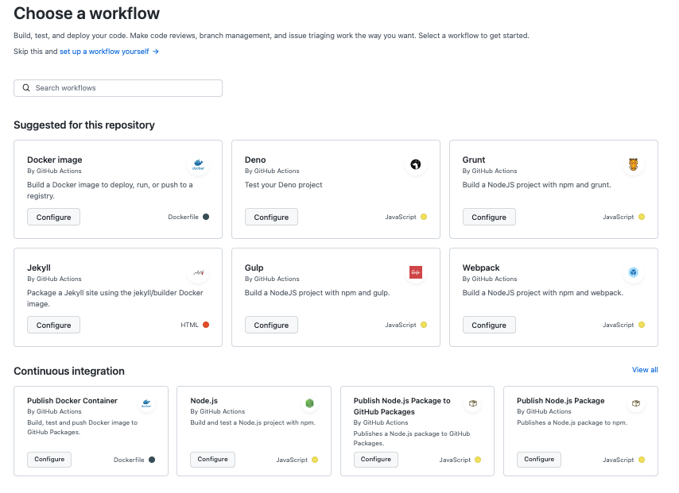

# Github Actions is a simplest one and easy to deploy
GitHub Actions is made by and for developers, so you don’t need dedicated resources to set up and maintain your pipeline. There’s no need to manually configure and set up CI/CD.Since GitHub Actions is fully integrated with GitHub, you can set any webhook as an event trigger for an automation or CI/CD pipeline. This includes things like pull requests, issues, and comments, but it also includes webhooks from any app you have integrated into your GitHub repository. 

## QuickStart   

### Step 1: Create or choose a repository, and pick a project
You can refere this link for create new repository [Creating and managing repositories](https://docs.github.com/en/repositories/creating-and-managing-repositories/quickstart-for-repositories)

### Step 2: Open GitHub Actions in your repository to start building your CI/CD workflow
To begin building your CI/CD pipeline, open the GitHub Actions tab in your repository’s top navigation bar.

You should see a list of CI/CD and workflow automation templates that match the technology your project uses (side note: We just improved this entire user flow.[(Check out the details later, if you’re interested)](https://github.blog/2021-12-17-getting-started-with-github-actions-just-got-easier/).

### Step 3: Make changes to your code to trigger your CI/CD pipeline
Before that look at my workflow file for your reference [workflow yml file](../.github/workflows/blank.yml)

### Step 4: Take a look at the workflow visualizer and live logs to get a full look into how your pipeline is running
Once you push the above change, you get to dive into the fun part: seeing your pipeline work in real time with a workflow visualizer and with live logs.

Okay, maybe this isn’t the most fun part, but knowing how to use both of these tools… you’ll thank me later.

Let’s go over the workflow visualizer first. Accessible via the Actions main page, a workflow visualizer can be pulled up by selecting whatever workflow you want to see. You’ll find something like this:  

Here, you can see which job in a given workflow happens when—and if they’re working or not with a little green check mark, a yellow sign to show if something’s working, and a red sign to show if a job failed.

This is your YAML workflow, but in visual form, and it makes it easier to see what’s happening when and if it’s working.

# https://github.blog/2022-02-02-build-ci-cd-pipeline-github-actions-four-steps/

## Here is my repository ci-cd pipeline

if you are done with all the things up to now, you can commit them, and push to your GitHub repository. The GitHub Actions automatically takes care of each step. Simply navigate to the ‘Actions’ tab within your repository to see the automated workflow in action. Furthermore hands-on experience of the pipeline’s automation, try making additional code changes, commit them, and push to the repository. Then your updates will seamlessly render on GitHub Pages without requiring any manual intervention.

Update the package.json

Add the homepage of the app to the package.json file

"homepage": "https://{your github id }.github.io/{repo name}/",

https://medium.com/@pathirage/step-in-to-ci-cd-a-hands-on-guide-to-building-ci-cd-pipeline-with-github-actions-7490d6f7d8ff